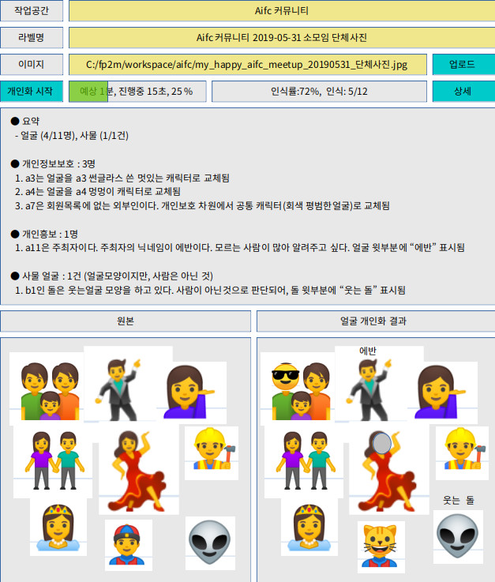

# AI fp2m Service & Library

## 화면디자인 예
* 제  목 : 샘플 예제(Aifc 커뮤니티 2019-05-31 소모임 단체사진)를 개인화(숨기기,알리기,비슷한것)하기
* 최초작성일 : 2019-05-31
* 최초작성자 : 임휘준

## 화면디자자인 작성방법
* LibreOffice Draw 화면 편집후 > 영역복사 > 이미지편집에 붙이기

## 출처
* 아이콘 이미지 출처 : Ubuntu 19.04 Server > 문자도구 프로그램 > 표정과 사람, 동물과 자연 탭

## 화면디자인
